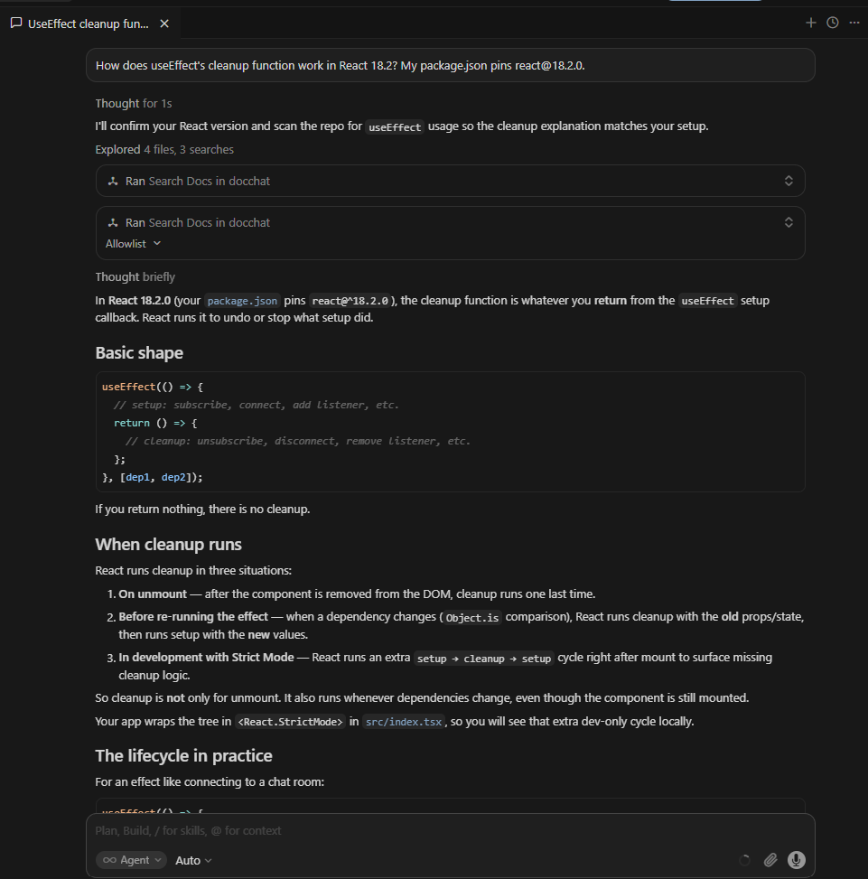
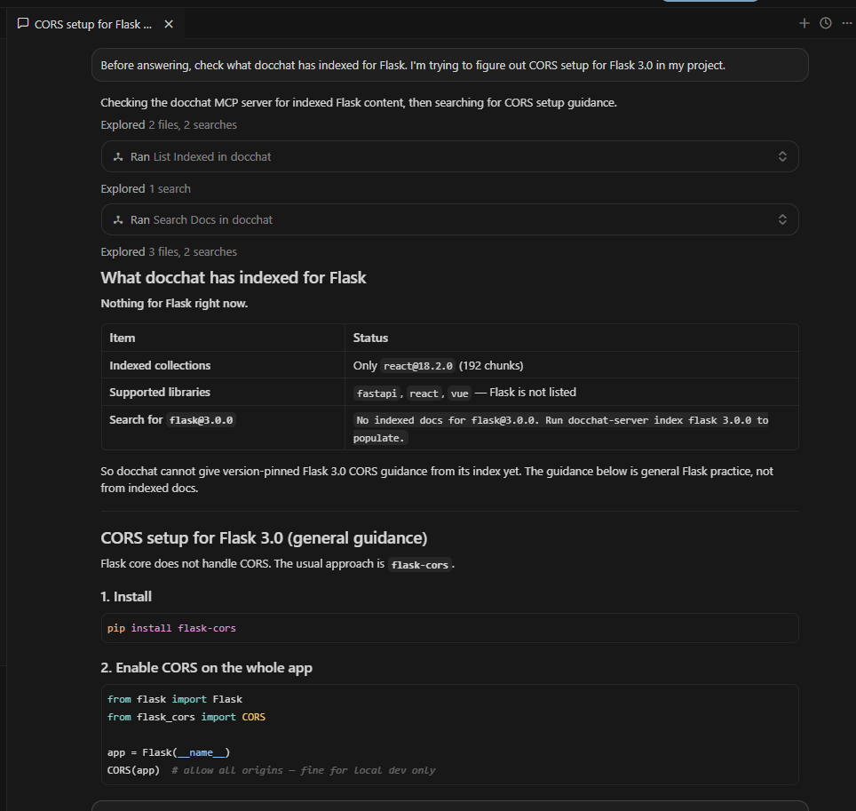
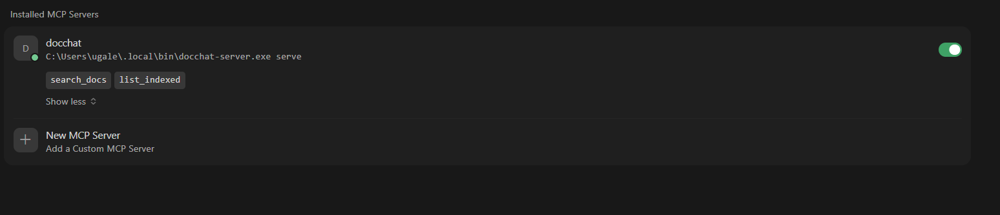

# docchat-server

> Version-pinned documentation retrieval as a Model Context Protocol server. Gives Claude Code / Cursor / any MCP-aware AI grounded answers from the docs of the exact library version your lockfile pins.

[](#)
[](https://pypi.org/project/docchat-server/)
[](./LICENSE)

LLM coding assistants answer library questions from training data, biased toward the newest version. If your project pins `react@18.2.0` and the latest is `19.x`, asking about `useEffect` gets you React 19 idioms — possibly with hooks (`use()`, `useActionState`) that don't exist in 18.2. `docchat-server` fixes that. Index the docs at the exact versions you pin. The MCP server exposes `search_docs(library, version, query)` to your AI. Now the answer comes from the right docs, with hard refusal when the question is out-of-scope.

---

## See it work

A Cursor Agent asks about useEffect cleanup in a React 18.2 project. It calls `search_docs` on docchat, gets back chunks from the React 18.2 reference, answers with version-grounded code:



Same Cursor session asked about Flask CORS (a library docchat doesn't have indexed). The server returns a clean "no docs" + the list of what IS indexed; the agent surfaces that honestly instead of hallucinating:



And here's the MCP server registered in Cursor's tool panel, showing the two tools (`search_docs` + `list_indexed`):



---

## Install

```bash
uv tool install docchat-server      # puts the binary on PATH (recommended)
# or:
pip install --user docchat-server
```

Requirements:
- Python 3.11+
- An `OPENAI_API_KEY` env var (used for query + index-time embeddings)

The Qdrant vector store runs **embedded** — no Docker, no separate server.

---

## Quickstart (3 commands + 1 config block)

```bash
export OPENAI_API_KEY=sk-...

# Index the libraries you pin. ~30–60s each, a few cents of embeddings cost.
docchat-server index react 18.2.0
docchat-server index fastapi 0.100.0
docchat-server index vue 3.4.0

# Verify
docchat-server list
```

Output:

```
Indexed collections:
  - react_18_2_0    (192 chunks)
  - fastapi_0_100_0 (38 chunks)
  - vue_3_4_0       (62 chunks)
Supported libraries: fastapi, react, vue
```

Then register the server with your MCP client.

### Cursor

`~/.cursor/mcp.json` (Windows: `%USERPROFILE%\.cursor\mcp.json`):

```json
{
  "mcpServers": {
    "docchat": {
      "command": "docchat-server",
      "args": ["serve"],
      "env": { "OPENAI_API_KEY": "sk-..." }
    }
  }
}
```

Restart Cursor. Open Settings → Tools & MCPs — `docchat` should appear with `search_docs` and `list_indexed` enabled.

### Claude Desktop

`~/Library/Application Support/Claude/claude_desktop_config.json` (macOS) or `%APPDATA%\Claude\claude_desktop_config.json` (Windows):

```json
{
  "mcpServers": {
    "docchat": {
      "command": "docchat-server",
      "args": ["serve"],
      "env": { "OPENAI_API_KEY": "sk-..." }
    }
  }
}
```

Fully quit Claude Desktop (tray icon → Quit, not close-window) and reopen.

### Cline / Continue.dev / any other MCP-aware client

Same JSON shape under that client's MCP config. The protocol is identical.

---

## The tools the AI can call

### `search_docs(library, version, query, api_name?, top_k?)`

Returns top-K chunks from the indexed docs of the exact pinned version. Drops hits below a per-library cosine-similarity floor (tuned per-library by eval). Returns the canonical string `"No relevant chunks found"` when nothing clears the floor — that's a signal to the calling LLM to refuse rather than guess.

### `list_indexed()`

Returns the (library, version) collections currently populated locally, plus the list of libraries this server's indexer knows how to populate. Useful as a session-start probe so the agent knows what's available before answering.

---

## What gets indexed (built-in libraries)

| Library | Versions | Source repo |
|---|---|---|
| React | any (defaults to `main` of `reactjs/react.dev`) | `reactjs/react.dev` |
| FastAPI | per-tag (e.g. `0.95.2`, `0.100.0` fetch from the matching git tag) | `tiangolo/fastapi` |
| Vue | any (defaults to `main` of `vuejs/docs`) | `vuejs/docs` |

FastAPI's per-tag fetching is the real demo: indexing `fastapi@0.95.2` gets the Pydantic-v1-era docs; indexing `fastapi@0.100.0` gets the Pydantic-v2-era docs. Two separate Qdrant collections, two different answers depending on what you pin.

Adding more libraries: extend `_LIBRARY_CONFIG` in `library_config.py` and submit a PR. Generic `--repo` / `--paths` CLI flags for arbitrary libraries land in v0.2.

---

## Known limitations (v0.0.x)

- **One MCP client at a time.** Embedded Qdrant holds a process-level file lock on `~/.docchat-server/qdrant/`. Running two MCP clients (e.g. Cursor + Claude Desktop) against the same docchat-server simultaneously will fail on the second one. Workaround: kill the other client, or switch to server-mode Qdrant (Docker) — v0.2 milestone.
- **You bring your own OpenAI key.** All embeddings (index-time + query-time) go through OpenAI. Local-embeddings option via `sentence-transformers` is v0.3 milestone.
- **Indexing is CLI-only, not an MCP tool.** Deliberate — exposing `index_library` as an MCP tool would let any connected LLM trigger arbitrary embedding cost. The user runs `docchat-server index` themselves.

---

## Related projects

Part of a 4-project portfolio of production AI engineering:

- **[DocChat VS Code extension](https://github.com/AshwinUgale/docchat)** ([Marketplace](https://marketplace.visualstudio.com/items?itemName=AshwinUgale.docchat)) — Same retrieval engine, chat panel instead of MCP tool surface.
- **[mneme](https://github.com/AshwinUgale/mneme)** ([PyPI as smolAmem](https://pypi.org/project/smolAmem/)) — Multi-tier memory used by the DocChat extension's agent.
- **[toolpicker](https://github.com/AshwinUgale/toolpicker)** ([PyPI](https://pypi.org/project/toolpicker/)) — Tool routing used by the DocChat extension's agent.

> The GitHub repo for this server is still named [`docchat-mcp`](https://github.com/AshwinUgale/docchat-mcp) (predates the PyPI rename to `docchat-server` — `docchat-mcp` was taken on PyPI).

---

## Roadmap

- **v0.1** — `detect_pinned_libraries(workspace_path)` MCP tool, `find_in_changelog(library, version, query)` MCP tool
- **v0.2** — `--repo` / `--paths` CLI flags for arbitrary library indexing; optional Docker-Qdrant backend for multi-client access
- **v0.3** — local embeddings via `sentence-transformers` (drops `OPENAI_API_KEY` requirement for embeddings)

---

## License

MIT. See [LICENSE](./LICENSE).
